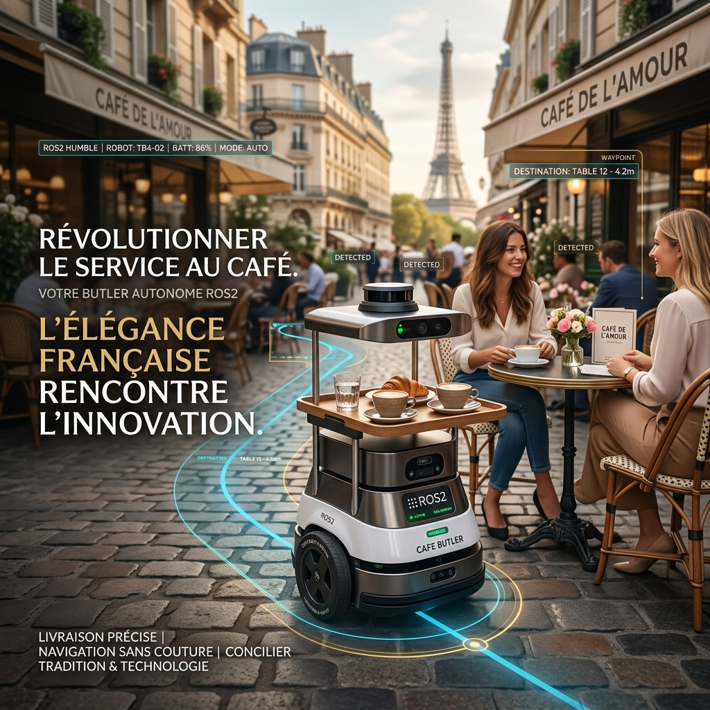
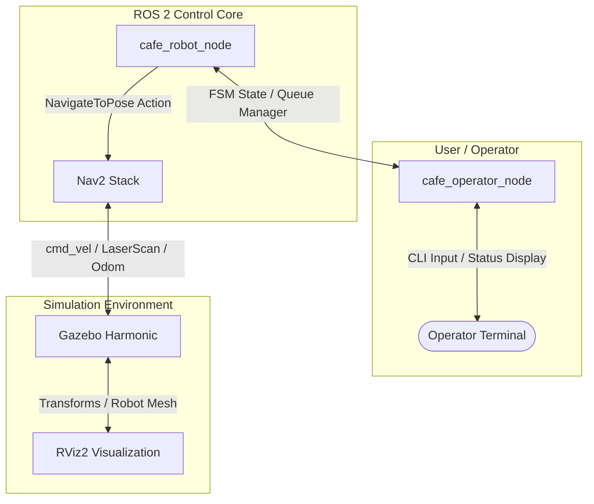

# ☕ French Café Butler Robot — ROS 2 Jazzy



An advanced autonomous service robot simulation developed on **ROS 2 Jazzy Jalisco** and **Gazebo Harmonic (GZ Sim)**. The robot serves as a restaurant butler in a French café environment, utilizing the **Nav2** navigation stack and a custom **Finite State Machine (FSM)**. It supports dynamic order queueing, interactive operator control via a CLI terminal, safety-critical cancellations, and automated order confirmations.

---

## 📖 Project Overview

The **French Café Butler Robot** (`cafe_robot`) is designed to automate table service in a Parisian-themed cafe simulation. The workspace consists of a custom-designed Gazebo world containing a kitchen area, multiple dining tables, and various static obstacles. 

Using a **TurtleBot3 Waffle** differential-drive platform equipped with a 2D LiDAR and wheel odometry, the robot maps the environment, localizes, and autonomously plans optimal collision-free paths. The core logic is governed by a robust state machine that transitions between states based on incoming order requests, manual/automatic confirmations, safety cancellations, and timeouts.

---

## ✨ Features

- 🗺️ **High-Fidelity Gazebo Simulation**: Chic Parisian-themed cafe environment built as an SDF world ([cafe_world.sdf](file:///home/sundar/french_cafe/src/cafe_robot/worlds/cafe_world.sdf)) featuring tables, chairs, planters, and counter walls.
- 🗺️ **PGM Occupancy Grid Map**: A resolution-matched occupancy map ([cafe_map.pgm](file:///home/sundar/french_cafe/src/cafe_robot/maps/cafe_map.pgm)) generated directly from the Gazebo world using a custom script ([generate_cafe_map.py](file:///home/sundar/french_cafe/src/cafe_robot/scripts/generate_cafe_map.py)).
- ⚡ **Autonomous Path Planning & Control**: Complete integration with **Nav2** (Action-based NavigateToPose), handling global path planning (NavFn) and local obstacle avoidance (DWB Controller).
- 🔄 **Robust Finite State Machine (FSM)**: A comprehensive FSM implemented in [cafe_robot_node.py](file:///home/sundar/french_cafe/src/cafe_robot/cafe_robot/cafe_robot_node.py) with structured transitions, recovery behaviors, and order queueing.
- 💬 **Interactive Operator CLI**: Command-line interface node ([cafe_operator_node.py](file:///home/sundar/french_cafe/src/cafe_robot/cafe_robot/cafe_operator_node.py)) to submit single or multi-table orders, cancel runs, and publish kitchen/table confirmations in real time.
- ⚙️ **Dual Confirmation Modes**: 
  - **Manual Confirmation**: Waits for kitchen collection and customer arrival confirmations with configurable timeouts.
  - **No Confirmation (Fully Autonomous)**: Auto-proceeds after a 2-second delay at each target point for simulation visibility.
- 🛑 **Safety-Critical Cancellation Logic**: Real-time retraction of navigation goals at any stage, ensuring the robot safely returns undelivered food to the kitchen before returning to home.

---

## 🏗️ Workspace Architecture

### Directory Structure
```text
french_cafe/
├── build/
├── install/
├── log/
└── src/
    └── cafe_robot/
        ├── cafe_robot/              # Python ROS2 source packages
        │   ├── __init__.py
        │   ├── cafe_goal_navigator.py # Action client sending single goals
        │   ├── cafe_operator_node.py  # Interactive operator control CLI
        │   ├── cafe_robot_node.py     # Main FSM controller node
        │   └── cancel_order.py        # Independent cancellation tool
        ├── config/                  # Configuration YAML files
        │   ├── bridge_config.yaml     # ros_gz_bridge topic mapping
        │   ├── cafe_poses.yaml        # Kitchen/table coordinates parameter
        │   └── nav2_params.yaml       # Nav2 planner/controller settings
        ├── launch/                  # Python Launch files
        │   ├── cafe_bringup_launch.py # All-in-one stack launcher
        │   ├── cafe_robot_launch.py   # Main simulation & nodes launcher
        │   ├── gazebo_world_launch.py # World-only launcher
        │   ├── navigation_launch.py   # Nav2 lifecycle nodes launcher
        │   └── spawn_robot_launch.py  # URDF and robot spawner launcher
        ├── maps/                    # Map files for localization
        │   ├── cafe_map.pgm           # Occupancy grid image
        │   └── cafe_map.yaml          # Map metadata
        ├── resource/
        ├── rviz/                    # RViz visualization configurations
        │   ├── cafe_robot.rviz
        │   └── nav2_cafe.rviz
        ├── scripts/                 # Utility and automated test scripts
        │   ├── cafe_operator_node.py
        │   ├── cancel_order.py
        │   ├── gen_map.py
        │   ├── generate_cafe_map.py   # Occupancy map generator
        │   ├── teleop_keyboard.py     # Keyboard manual teleoperation
        │   └── test_single_delivery.py# Automated single-delivery tester
        ├── test/                    # Linter tests
        ├── package.xml              # Package manifest
        ├── setup.cfg
        └── setup.py                 # Setuptools installation script
```

### Component Flow Block Diagram



---

## 🔄 Finite State Machine (FSM) Explanation

The robot's operational lifecycle is modeled as a state machine. It is designed to handle both **interactive manual confirmations** and **fully autonomous runs** based on the dynamic parameter `require_confirmation`.

```mermaid
stateDiagram-v2
    [*] --> IDLE
    IDLE --> GO_TO_KITCHEN : Order Received (Order Queue populated)
    GO_TO_KITCHEN --> WAIT_KITCHEN_CONFIRM : Arrived at Kitchen / Goal Succeeded

    state WAIT_KITCHEN_CONFIRM {
        [*] --> CheckConfMode
        CheckConfMode --> AutoProceed : require_confirmation = False (Wait 2s)
        CheckConfMode --> WaitManual : require_confirmation = True
        WaitManual --> GO_TO_TABLE : Kitchen Confirm (Single target)
        WaitManual --> MULTI_DELIVERY : Kitchen Confirm (Multiple targets)
        WaitManual --> RETURN_HOME : Kitchen Timeout (30s) or Cancelled
    }

    state GO_TO_TABLE {
        [*] --> NavigateToTable
        NavigateToTable --> WAIT_TABLE_CONFIRM : Arrived
        NavigateToTable --> RETURN_KITCHEN : Cancel Target
    }

    state MULTI_DELIVERY {
        [*] --> NavigateToNextTable
        NavigateToNextTable --> WAIT_TABLE_CONFIRM : Arrived
        NavigateToNextTable --> SkipTable : Cancel / Skip Specific Table
        SkipTable --> NavigateToNextTable : Next table in queue
        SkipTable --> RETURN_KITCHEN : No more tables in queue
    }

    state WAIT_TABLE_CONFIRM {
        [*] --> CheckTableConfMode
        CheckTableConfMode --> AutoServe : require_confirmation = False (Wait 2s)
        CheckTableConfMode --> WaitTableManual : require_confirmation = True
        
        AutoServe --> MULTI_DELIVERY : Next Table Exists
        AutoServe --> RETURN_HOME : Last Table & No Failures
        AutoServe --> RETURN_KITCHEN : Last Table & Failures/Cancellations

        WaitTableManual --> MULTI_DELIVERY : Confirmed & Next Table Exists
        WaitTableManual --> RETURN_HOME : Confirmed & Last Table & No Failures
        WaitTableManual --> RETURN_KITCHEN : Confirmed & Last Table & Failures/Cancellations
        WaitTableManual --> MULTI_DELIVERY : Timeout/Cancel & Next Table Exists (Mark Failure)
        WaitTableManual --> RETURN_KITCHEN : Timeout/Cancel & Last Table (Mark Failure)
    }

    RETURN_KITCHEN --> RETURN_HOME : Arrived at Kitchen
    RETURN_HOME --> IDLE : Arrived at Home
```

### 📋 Detailed State Descriptions

| State | Description | Transitions |
| :--- | :--- | :--- |
| **`IDLE`** | Robot sits at the `home` pose waiting for order commands. | Transitions to `GO_TO_KITCHEN` when a `/new_order` message is received. |
| **`GO_TO_KITCHEN`** | Robot navigates to the kitchen counter to collect food. | Transitions to `WAIT_KITCHEN_CONFIRM` upon arrival at coordinates `[-3.0, 2.8]`. |
| **`WAIT_KITCHEN_CONFIRM`** | Robot waits for confirmation that the food has been loaded. | - If `require_confirmation` is **False**: Auto-proceeds after 2 seconds.<br>- If `require_confirmation` is **True**: Transitions to `GO_TO_TABLE` (single order) or `MULTI_DELIVERY` (multiple orders) when `/kitchen_confirm` is received. Transitions to `RETURN_HOME` on timeout or cancellation. |
| **`GO_TO_TABLE`** | Robot navigates to the single ordered table. | Transitions to `WAIT_TABLE_CONFIRM` upon arrival. Transitions to `RETURN_KITCHEN` if cancelled. |
| **`MULTI_DELIVERY`** | Robot cycles through multiple table coordinates. | Transitions to `WAIT_TABLE_CONFIRM` upon arrival at the active table. If a table is cancelled, it skips it and proceeds to the next target. |
| **`WAIT_TABLE_CONFIRM`** | Robot waits at the table for the customer to take the food. | - If `require_confirmation` is **False**: Auto-proceeds after 2 seconds.<br>- If `require_confirmation` is **True**: Transitions to `MULTI_DELIVERY`/`RETURN_HOME`/`RETURN_KITCHEN` when `/table_confirm` is received. On timeout or cancellation, marks delivery as failed, then continues to the next table or returns via `RETURN_KITCHEN`. |
| **`RETURN_KITCHEN`** | Robot returns to the kitchen first (e.g. to return cancelled/undelivered food). | Transitions to `RETURN_HOME` once it successfully reaches the kitchen coordinates. |
| **`RETURN_HOME`** | Robot returns to the charging/waiting dock at the `home` pose. | Transitions to `IDLE` once it reaches `home` coordinates `[-3.5, -1.0]`. |

---

## 📡 ROS Graph Explanation

The node interface defines the communication API for the `cafe_robot` package. Below is the breakdown of the topics and action interface.

### Topics & Action Interfaces

```text
       [/new_order]  ──(Sub)──┐
    [/cancel_order]  ──(Sub)──┼───> [cafe_robot_node] ───(Action Client)───> [navigate_to_pose]
 [/kitchen_confirm]  ──(Sub)──┤            │
   [/table_confirm]  ──(Sub)──┘            └───(Pub)───> [/robot_status]
```

#### Publications
- **/robot_status** (`std_msgs/msg/String`): Publishes the current state, target, and remaining queue of the robot FSM (e.g. `State: MULTI_DELIVERY | Target: TABLE2 | Queue: ['table3']`).
- **/cafe_robot/status** (`std_msgs/msg/String`): Legacy status publication topic for backwards-compatibility.

#### Subscriptions
- **/new_order** (`std_msgs/msg/String`): Receives target table IDs. Accepted values: `table1`, `table2`, `table3`.
- **/cafe_robot/order** (`std_msgs/msg/String`): Legacy order subscription topic.
- **/cancel_order** (`std_msgs/msg/String`): Receives cancellation commands. Accepted values: `table1`, `table2`, `table3`, or `all`.
- **/cafe_robot/cancel** (`std_msgs/msg/String`): Legacy cancellation topic.
- **/kitchen_confirm** (`std_msgs/msg/String`): Receives confirmations for food collected from the kitchen counter.
- **/cafe_robot/kitchen_confirm** (`std_msgs/msg/String`): Legacy kitchen confirmation topic.
- **/table_confirm** (`std_msgs/msg/String`): Receives confirmations for food served at a table. Content must match the target table ID (e.g. `table1`).
- **/cafe_robot/table_confirm** (`std_msgs/msg/String`): Legacy table confirmation topic.

#### Action Clients
- **navigate_to_pose** (`nav2_msgs/action/NavigateToPose`): Sends 2D pose goals (X, Y, Orientation Z/W) to the Nav2 navigator stack to move the robot.

---

## 🧭 Nav2 Stack Implementation

The **Nav2 (Navigation 2)** stack is configured specifically for the Waffle differential platform in the café world:

1. **AMCL Localization**: Standard Adaptive Monte Carlo Localization that determines the robot's pose on the map using laser scans and odometry.
2. **Map Server**: Loads [cafe_map.yaml](file:///home/sundar/french_cafe/src/cafe_robot/maps/cafe_map.yaml) and [cafe_map.pgm](file:///home/sundar/french_cafe/src/cafe_robot/maps/cafe_map.pgm) to serve static map data.
3. **Planners & Controllers**:
   - **Global Planner**: Uses `nav2_navfn_planner/NavfnPlanner` to compute the shortest obstacle-free path on the global costmap.
   - **Local Controller**: Uses `nav2_dwb_controller/DWBLocalPlanner` to compute control velocities (`cmd_vel`) that avoid dynamic obstacles and follow the global path.
4. **Recovery Behaviors**: Configured back-up and spin recovery behaviors to resolve navigation bottlenecks.
5. **Auto-Localization Publisher**: The bringup launch file ([cafe_bringup_launch.py](file:///home/sundar/french_cafe/src/cafe_robot/launch/cafe_bringup_launch.py)) automatically publishes an initial pose (`/initialpose`) of `[-3.5, -1.0]` with a `10.0s` delay to initialize AMCL without requiring manual interaction in RViz.

---

## 🛠️ Setup Instructions

### Prerequisites

Ensure the following packages are installed on your **Ubuntu 24.04** environment with **ROS 2 Jazzy**:
```bash
# Update package list
sudo apt update

# Install ROS2 Jazzy Navigation stack
sudo apt install ros-jazzy-navigation2 ros-jazzy-nav2-bringup

# Install Gazebo Harmonic (GZ Sim) and its ROS integration bridge
sudo apt install ros-jazzy-ros-gz-sim ros-jazzy-ros-gz-bridge ros-jazzy-xacro
```

Make sure the package dependency `nav2_minimal_tb3_sim` is available in your workspace or share directory.

### Build Instructions

1. Clone or copy this package into your ROS 2 workspace:
   ```bash
   cd ~/french_cafe
   ```
2. Build the package using `colcon`:
   ```bash
   colcon build --packages-select cafe_robot
   ```
3. Source the install setup file:
   ```bash
   source install/setup.bash
   ```

---

## 🚀 Run Instructions

Running the complete simulation suite requires three separate terminal sessions (all sourced with your ROS 2 workspace):

### 1. Launch the Simulation and Nav2 Stack
This starts Gazebo, loads the cafe world, spawns the Turtlebot Waffle at `home`, launches Nav2, and starts RViz2:
```bash
ros2 launch cafe_robot cafe_bringup_launch.py
```
> [!NOTE]
> The robot will automatically localize itself at the home position after 10 seconds. You will see a message in the terminal indicating `/initialpose` has been successfully published.

### 2. Start the FSM Controller Node
Run the core decision-making FSM node.

- **Option A: With Confirmation Required (Default - handles interactive workflows)**
  ```bash
  ros2 run cafe_robot cafe_robot_node
  ```
- **Option B: Without Confirmation (Fully Autonomous mode)**
  ```bash
  ros2 run cafe_robot cafe_robot_node --ros-args -p require_confirmation:=false
  ```
- **Custom Timeout Settings (e.g. 10.0s instead of default 30.0s)**
  ```bash
  ros2 run cafe_robot cafe_robot_node --ros-args -p confirm_timeout:=10.0
  ```

### 3. Open the Operator Control Terminal
Run the interactive CLI utility to control the robot and monitor status updates:
```bash
ros2 run cafe_robot cafe_operator_node
```

Within the operator terminal, you will see a command prompt:
```text
=================================================================
☕  FRENCH CAFE ROBOT - DISPATCH & OPERATOR CONTROL TERMINAL
=================================================================
Supported Commands:
  - order <table_id(s)>  (e.g., 'order table1', 'order table1 table2 table3')
  - cancel <table_id>    (e.g., 'cancel table1')
  - confirm kitchen      (confirm food collected at kitchen)
  - confirm <table_id>   (confirm food served at table)
  - status               (print current robot status)
  - exit                 (quit the operator node)
=================================================================
operator > 
```

---

## 🧪 Operational Test Cases

The following test scenarios verify the robust state machine logic under different edge cases.

### Test Case 1: Single Delivery (No Confirmation Mode)
1. Launch the FSM with confirmation disabled:
   ```bash
   ros2 run cafe_robot cafe_robot_node --ros-args -p require_confirmation:=false
   ```
2. Send an order in the operator CLI:
   `order table1`
3. **Verify**:
   - Robot moves from `home` ➔ `kitchen`.
   - Waits for 2 seconds at the kitchen counter, then auto-proceeds.
   - Navigates to `table1`.
   - Waits for 2 seconds at `table1`, then auto-proceeds.
   - Navigates back `home` and goes into `IDLE`.

### Test Case 2: Single Delivery with Kitchen Timeout
1. Launch FSM with default parameter (`require_confirmation:=true`, `confirm_timeout:=15.0`).
2. Command: `order table2`
3. **Verify**:
   - Robot navigates from `home` ➔ `kitchen`.
   - Do **not** issue a confirmation.
   - After 15 seconds, a timeout warning triggers, and the robot transitions to `RETURN_HOME`.
   - Robot returns to `home` and enters `IDLE`.

### Test Case 3: Single Delivery with Table Timeout
1. Launch FSM with `confirm_timeout:=15.0`.
2. Command: `order table3`
3. **Verify**:
   - Robot goes from `home` ➔ `kitchen`.
   - Confirm food collected: `confirm kitchen`
   - Robot navigates to `table3`.
   - Do **not** confirm delivery.
   - After 15 seconds, a timeout occurs. Since food was collected, the robot must return the food.
   - Robot transitions to `RETURN_KITCHEN`, navigates back to the kitchen counter, then transitions to `RETURN_HOME`.
   - Robot returns `home` and enters `IDLE`.

### Test Case 4: Mid-Transit Cancellation (Going to Kitchen)
1. Command: `order table1`
2. While the robot is traveling to the kitchen, command: `cancel table1`
3. **Verify**:
   - Robot cancels the current navigation goal.
   - Transitions directly to `RETURN_HOME` (bypassing kitchen as no food was collected).
   - Robot returns `home` and enters `IDLE`.

### Test Case 5: Mid-Transit Cancellation (Going to Table)
1. Command: `order table1`
2. Confirm food collected at kitchen: `confirm kitchen`
3. While the robot is traveling from the kitchen to `table1`, command: `cancel table1`
4. **Verify**:
   - Robot cancels the active table navigation goal.
   - Transitions to `RETURN_KITCHEN` (to drop off collected food).
   - Upon arriving at the kitchen, transitions to `RETURN_HOME`.
   - Robot returns `home` and enters `IDLE`.

### Test Case 6: Multiple Deliveries (All Successful)
1. Command: `order table1 table2 table3`
2. **Verify**:
   - Robot navigates to `kitchen`.
   - Confirm food: `confirm kitchen`
   - Robot navigates to `table1`. Confirm: `confirm table1`
   - Robot navigates to `table2`. Confirm: `confirm table2`
   - Robot navigates to `table3`. Confirm: `confirm table3`
   - Since all deliveries were successful, the robot transitions directly to `RETURN_HOME` (bypassing the kitchen).
   - Robot returns `home` and enters `IDLE`.

### Test Case 7: Multiple Deliveries with Specific Table Cancellation
1. Command: `order table1 table2 table3`
2. Confirm food at kitchen: `confirm kitchen`
3. While the robot is traveling to `table1`, cancel `table2`: `cancel table2`
4. **Verify**:
   - Robot arrives at `table1`. Confirm: `confirm table1`
   - Robot skips `table2` entirely and plans a path directly to `table3`.
   - Arrives at `table3`. Confirm: `confirm table3`
   - Since one order (`table2`) was cancelled, there is leftover food. The robot transitions to `RETURN_KITCHEN` to drop off the food, then returns `home`.

---

## 📷 Screenshots

*Note: In the simulation repository, you can review the generated mapping and world screenshots below:*

````carousel

<!-- slide -->

````

> [!TIP]
> Keep your local screenshots saved in the `media/` folder and update this section to keep your workspace clean.

## 🎥 Demo Videos

For a walkthrough of the FSM and Nav2 executing the test cases, watch the demo videos below:

### 📹 Part 1: Full Navigation & Delivery Operations
<video src="https://raw.githubusercontent.com/sundaramn353-dot/ros2-cafe-butler-robot/main/media/demo_video1.webm" controls width="100%"></video>

### 📹 Part 2: FSM Cancellations & Timeout Behaviors
<video src="https://raw.githubusercontent.com/sundaramn353-dot/ros2-cafe-butler-robot/main/media/demo_video2.webm" controls width="100%"></video>

*Recorded in Gazebo Harmonic simulation.*

## 🚀 Future Improvements

1. 👥 **Human-Aware Navigation (Social Nav)**: Integrate social force models or costmap filters to navigate smoothly around walking customers and staff.
2. 📱 **Web Dashboard interface**: Replace the interactive terminal CLI with a web application dashboard (e.g. built on ROS2 Web Bridge) for waitstaff to easily assign table orders.
3. 🔋 **Automatic Docking & Charging**: Add battery monitoring topics and a dock action server, transitioning the FSM to a charging state when the battery is low.
4. 🍽️ **Physical Butler Platform**: Port the simulation stack to a physical differential butler platform with food carrier trays.
# ros2-cafe-butler-robot
